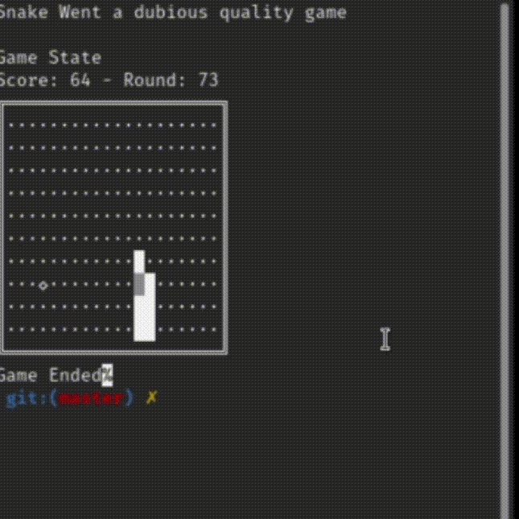

# SnakeWent
This Project is a Portfolio one, implementing a basic Golang version of the [Snake game](https://en.wikipedia.org/wiki/Snake_(video_game_genre)) on the command line. 

:exclamation: :warning: Disclaimer: This go code is not supposed to behave like the above. it is a gif of the older game

:exclamation: :warning: Disclaimer: This go code is not lint, and doesn't have unit testing, this was my first go project.

## Running
`git clone https://github.com/afa7789/SnakeWent`

`cd SnakerWent`

possible to be runned with or without the flags, without it you will be running with default size.

`go run main.go --width=20 --height=10`

## About

This was made with the objective of showing capabilities of encapsulating and reutilization of code.
So this don't have the best performance needed.
And more, the way the input works was asked as the way it is, afteall this code is for a challenge made and this was one of the requisites of it.

the package:
- printer: is a package exclusively to use fmt, so i could showcase the encapsulation of it.
- gamestruct: it's the game structs ( node, gamestate, position) struct and builder functions
- boardlogic: it's functions to fill the 2d Array with it's ints
- gamelogic: it's gamelogic functions, you know , when it eats, increase snake, wall hit, round iteration,etc.
- gamedrive: it's the game start function
- receiveInput: it's a encapsullation of the keyboard reading to get arrow keys to work on this.

